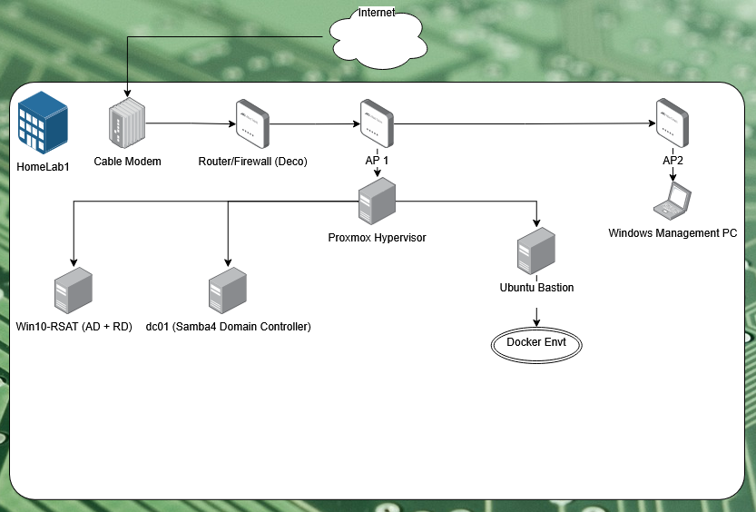

# 🏠 Home Lab Infrastructure Project

## 📌 Test IT Solution

Home Lab Infrastructure for Skills Development & Portfolio Showcase

## 📚 Table of Contents

- [Overview](#overview)  
- [Existing Architecture](#existing--architecture)  
- [Features](#features)  
- [Installation](#installation)  
- [Usage](#usage)  
- [Screenshots / Diagrams](#screenshots--diagrams)  
- [Configuration](#configuration)  
- [Security](#security)  
- [Todo / Roadmap](#todo--roadmap)    
- [Author](#author)

## Overview

This project is a comprehensive home lab built to sharpen infrastructure, networking, and automation skills. It serves as a living portfolio for demonstrating cloud-native and systems architecture competencies.

## Existing Architecture

- Physical Server host running Proxmox VE  
- Physical Windows host for management  
- Linux VMs
	- Docker host
	- Bastion host
	- Ubuntu host for Samba4
- Windows VM
	- RSAT (AD tools)
	- Bastion for Remote Desktop
	- Docker Desktop
- SSH key-based authentication (ED25519)
- purchased domain: blinkinlights.cc from Cloudflare as registrar

## Features

- Proxmox hypervisor with GUI and CLI access  
- Wake-on-LAN setup for energy efficiency  
- Static DHCP leases and hostname resolution  
- Local DNS with Samba4 for Domain Control
- SSH hardened with key authentication only  
- RSAT ID Management (Active Directory)
- Windows Management Machine
	- Git Bash
	- Python, Git paths added to System Environment Variables for PowerShell
	- SpiceViewer installed for Windows VMs

## Installation

1. Set up Proxmox on bare metal  
2. Configure VMs with static IPs and hostnames  
3. Set up Samba4 for DNS  
4. Disable root SSH, set up sudo user  
5. Generate SSH keys  
6. Setup local Git repository, configure terminal environments  
7. Set up identity management  
8. Generate machine templates for automation  
9. Purchase blinkinlights.cc domain  
10. Configure WAF security  
11. Install RSAT on Windows VM and take a VM snapshot for temporary license renewal  

## Usage

- SSH into VMs: `ssh user@vm-name.local`  
- Start Proxmox via Wake-on-LAN from another machine  
- Use Git Bash or PowerShell for terminal work  
- Use web interfaces when necessary/advantageous  
- Use Powershell and Python for scripting

## Screenshots / Diagrams

## Configuration

- `/etc/ssh/sshd_config`: Root login disabled  
- `~/.ssh/config`: Host shortcuts (optional)  
- System environment path configured for Git, Python

## Security

- SSH: ED25519 keys, root login disabled  
- Local-only services, firewall enforced  
- Limited user accounts with sudo access

## Todo / Roadmap

- Add Docker containerization for web services
- Establish identity management for centralized security  
- Auth solution w/ an IDp
- Deploy Cloudflare CDN
- Integrate w/ AWS dev+prod environments
- Vulnerability Scanning with Tenable Nessus
- Implement monitoring with Prometheus + Grafana  
- Set up CI/CD pipelines  
- Automate with Ansible
- IAC w/ Terraform

## Author

Eric — aspiring Solutions Architect
